# PyCitySchools School District Analysis
## An analysis of school student performance data and recreation of associated dataframe.
### Richard E Barber 2021

#### Analysis Results

##### Effect of Data Adjustment on District Summary

|    |
|  :---:  |
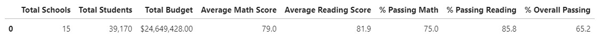</img>
| Original Data: District Summary |

|    |
|  :---:  |
</img>
| Original Data: District Summary |

As you can see the data adjustment resulted in only minute changes to district-wide performance tables.

* The Overall Passing Rate has diminished by .3 points.
* Other data remain unchanged

##### Effects of Data Adjustment on School Summary

|    |
|  :---:  |
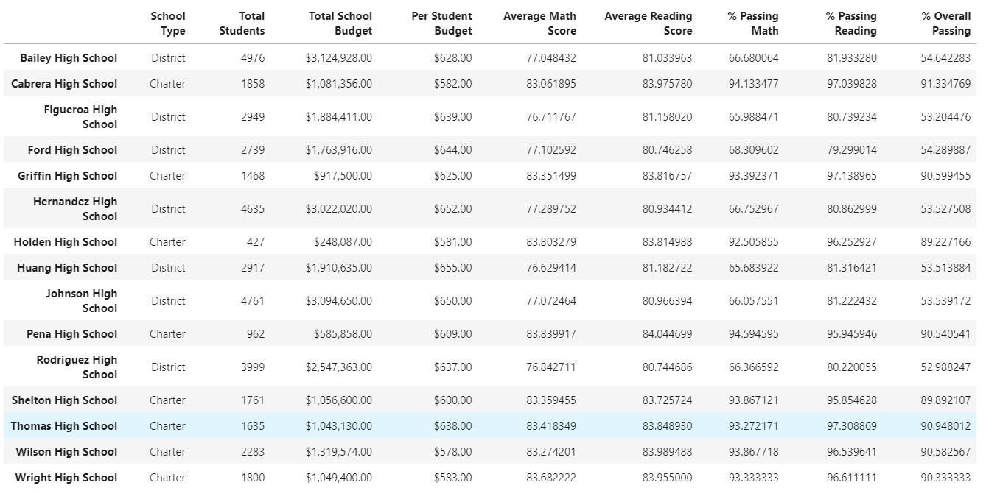</img>
| Original Data: School Summary |

|    |
|  :---:  |
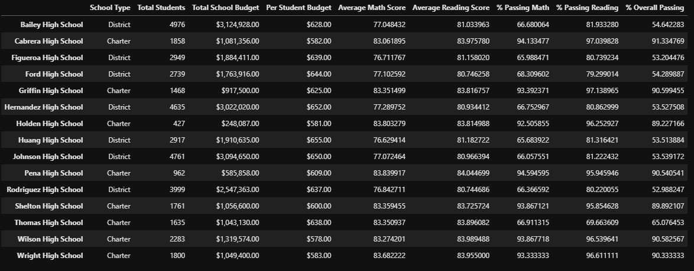</img>
| Adjusted Data: School Summary |

In the Adjusted data table, significant changes occurred in the three % Passing categories at Thomas High School due to the requested removal of some elements of the 9th-grade records.

* Passing Rates for Math, Reading and Overall have dropped by nearly 30 points.

#### Effects of the Removal of Specified Grade Data

In this task the analyst was requested to remove math and reading score data from the records of the 9th graders at Thomas High School.  Below we show the tabular data representing the original dataframe and the recreated adjusted model.

##### Math and reading scores by grade

|    |    |
|  :---:  |  :---:  |
| 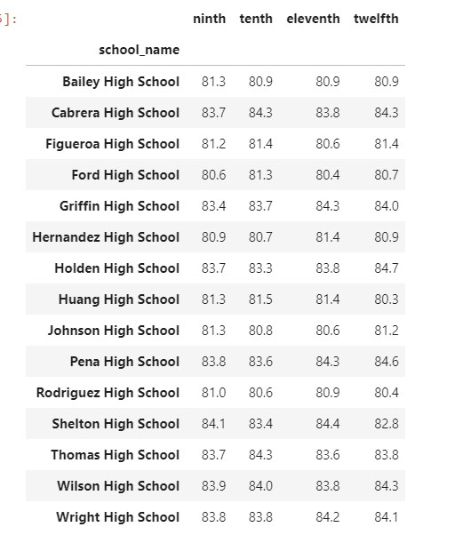</img> | 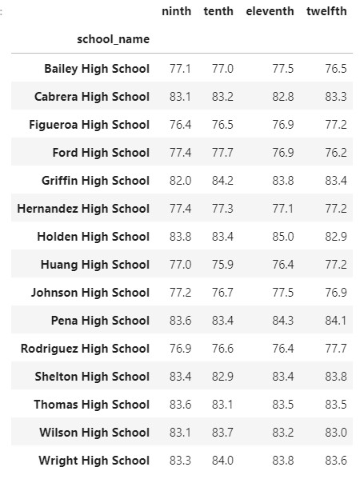</img>|
| Original Reading Score Data | Original Math Score Data |

|    |    |
|  :---:  |  :---:  |
|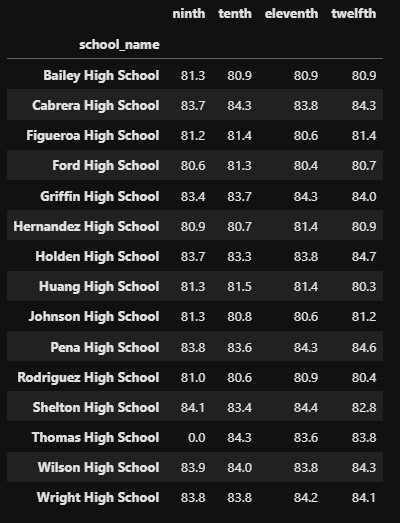</img>|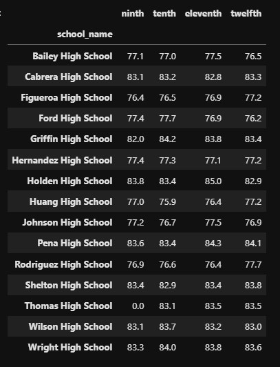</img>|
| Adjusted Reading Score Data | Adjusted Math Score Data |

The 9th Grade scores for Reading and Math are shown in the Original data screens, and missing from the Adjusted score data screens. The data in those records were filled wih `numpy.NaN`s and later filled with `0`s for computation purposed.

##### Scores by School Spending
|    |
|  :---:  |
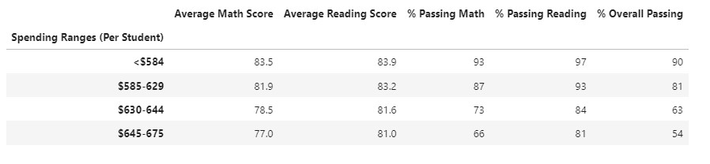</img>
| Original Data: Scores by School Spending

|    |
|  :---:  |
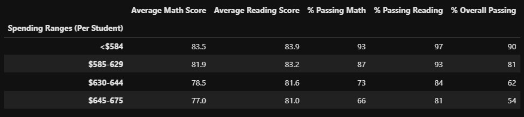</img>
| Adjusted Data: Scores by School Spending

As a result of the data adjustments made, there was only a 1/10th point change in one of the school spending categories.

##### Scores by School Size

|    |
|  :---:  |
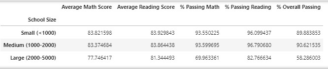</img>
| Original Data: Scores by School Size

|    |
|  :---:  |
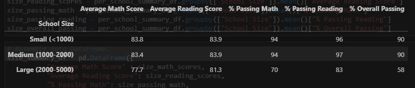</img>
| Adjusted Data: Scores by School Size

The data for Scores by School type was not significantly changed by the adjustment made to school records.

##### Scores by School Type

|    |
|  :---:  |
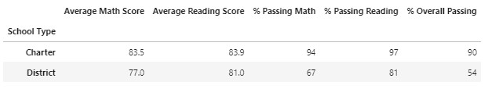</img>
| Original Data: Scores by School Type

|    |
|  :---:  |
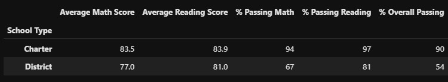</img>
| Adjusted Data: Scores by School Type

There were also no significant changes to the output of the Scores by School Type data as a result of the adjustment.

#### Summary

After replacing the suspect 9th grade data from Thomas High School with `NaN`s there were a few notable changes to the district analyses:
1) The Overall Passing Rate for school which spend $630-$644 per student dropped 1 point from 63 to 62 percent.
2) The Overall Passing Rate for medium sized (1000-2000) schools dropped by almost 1 point from 91 to 90 percent.
3) The Math, Reading, and Overall Passing Rates for Thomas High School plummets nearly 30 points from in the 90s to in the 60s.
4) The Math and Reading Grades for Thomas High School 9th Graders has been eliminated.
